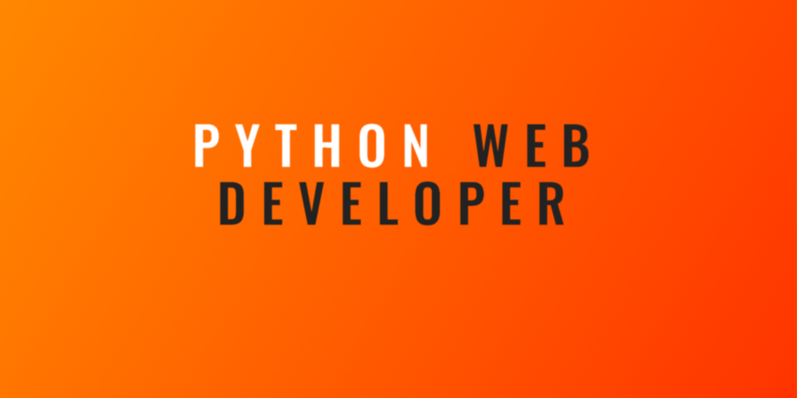

<h2>About Me</h2>

<i>Python Web Developer – APIs, Django, Flask</i>. Adept in various stages of the web development life cycle. MBA Alumnus, and MSc Computer Science With Software Engineering. A keen focus on developing static, dynamic, e-commerce, portal, and content management web applications.

<b>Additional</b>: <i>Product Management</i>, including planning, budget management, and coordinating all working parts of a project, assessing customer desires and requirements to generate a product that meets those standards, and determining product specifications, production timelines, and in-depth plans for product development.

<h2>Languages and Technologies</h2>

AWS, Atom, CSS, D3.js, Django, Django REST Framework, Docker, Flask, Git, GitHub, HTML, Heroku, Jasmine, JavaScript, Linux, MongoDB, MySQL, PHP, PostgreSQL, Python, SASS, Visual Studio Code, Vue.js, jQuery.

<h2>Connect On</h2>

[][linkedin]
[][website]
[][medium]
 

---

    
:zap: Github stats

    

[website]: https://www.sipo.io/
[medium]: https://medium.com/@sipocharles18
[linkedin]: https://www.linkedin.com/in/sipo-cyrus-charles/