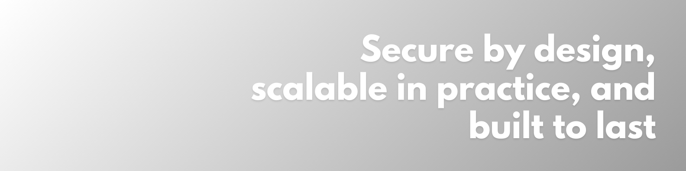

# Sipo Charles — Software Systems Engineer

**Blockchain, Distributed and Secure Architectures**  
📍 London, UK (GMT) | 🌍 Open to remote and hybrid opportunities

_Last updated: Sept 2025_

---

## 🚀 About Me

I design infrastructures that **protect data, reduce risk, and scale with resilience**.  
I engineer **secure, distributed, and scalable systems** by combining blockchain engineering, cybersecurity practices, and systems architecture to align technology with business and compliance goals.

- 🔐 **Secure by design** — delivered with compliance awareness (GDPR/HIPAA).
- ⚡ **Scalable in practice** — tested with blockchain frameworks (Hyperledger, Ethereum testnets) and distributed storage (IPFS).
- 🎯 **Strategically aligned** — informed by MSc technical depth and MBA strategic insight.

_Now:_ focusing on secure-by-design distributed workflows and resilience testing in blockchain-based systems.

---

## 🛠 Core Skills

- **Software and Systems Engineering** — cloud, distributed frameworks, systems design
- **Blockchain Engineering** — Hyperledger, Ethereum testnets, IPFS integrations
- **Secure Development** — threat modelling, secure coding workflows, compliance checks, Zero Trust principles, secrets management, PII handling, data minimization
- **Systems Architecture and Strategy** — aligning infrastructures with business and regulation
- **Project and Stakeholder Management** — delivery discipline with PRINCE2

_Additional expertise:_ platform engineering, cloud architecture (AWS), IAM, resilience engineering.

---

## 📌 Featured Projects

### 🏥 Blockchain Framework for Healthcare Data

Designed and evaluated a **decentralised framework** for managing clinical narratives.

- Implemented with blockchain (Hyperledger and Ethereum testnets) and IPFS.
- Evaluated scalability, resilience, and compliance alignment (GDPR/HIPAA).  
  🔗 [Case study → sipo.io](https://sipo.io)

---

### ☁️ Web and Cloud Applications

Built **secure, full-stack applications** using Python, Django, and JavaScript, deployed to cloud environments.

- Focused on application stability and security through coding best practices.
- Delivered systems designed for reliability and scalability.  
  🔗 [Portfolio → sipo.io](https://sipo.io)

---

### ✍️ Technical Writing and Research

Authored research and articles on:

- Decentralisation and distributed systems
- Secure software practices and compliance
- Resilient blockchain and cloud architectures

🔗 [Articles → sipo.io](https://sipo.io)

---

## 🎓 Education and Certifications

**MSc — Computer Science with Software Engineering (2025)** — dissertation: blockchain framework for secure and compliant healthcare data.  
**MBA — Business Administration and Management (2021)** — research on emerging technologies and sustainability.  
**Diploma — Software Development (Code Institute, 2019)** — secure, full-stack builds with Python, Django, JavaScript.  
**PRINCE2 — Project Management Certification (2017)** — structured delivery, risk management, compliance.

---

## 🧰 Tooling Snapshot

       

---

## 🤝 Connect

- [LinkedIn](https://www.linkedin.com/in/sipo-cyrus-charles/)
- [Portfolio → sipo.io](https://www.sipo.io)
- 📧 Email: Find it on my Portfolio/LinkedIn

📌 Open to opportunities in **Software and Systems Engineering, Distributed Systems, Secure Architecture, and Blockchain Engineering.**

**Links (for screen readers):** LinkedIn: https://www.linkedin.com/in/sipo-cyrus-charles/ • Portfolio: https://www.sipo.io • Email: Find it on my Portfolio/LinkedIn
