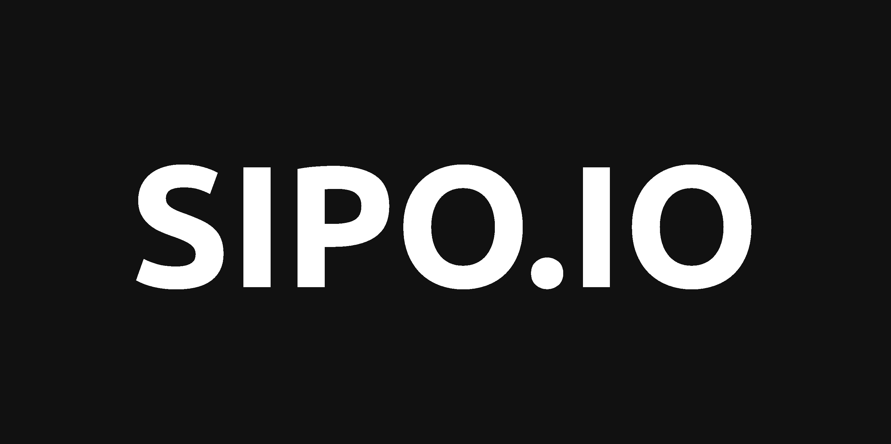

<h2>About</h2>

💻 𝐒𝐨𝐟𝐭𝐰𝐚𝐫𝐞 𝐄𝐧𝐠𝐢𝐧𝐞𝐞𝐫: Adept in various stages of the software development life cycle (SDLC), heavily invested in the Python ecosystem. MSc Computer Science with Software Engineering candidate.

Key knowledge areas include but are not limited to: -
𝐃𝐚𝐭𝐚𝐛𝐚𝐬𝐞 𝐒𝐲𝐬𝐭𝐞𝐦𝐬: Database Design, Relational Databases and SQL, Database Integrity and Security.
𝐌𝐨𝐛𝐢𝐥𝐞 𝐀𝐩𝐩 𝐃𝐞𝐯𝐞𝐥𝐨𝐩𝐦𝐞𝐧𝐭: Design and implementation of mobile applications with Java for Android.
𝐒𝐨𝐟𝐭𝐰𝐚𝐫𝐞 𝐃𝐞𝐯𝐞𝐥𝐨𝐩𝐦𝐞𝐧𝐭 𝐟𝐨𝐫 𝐭𝐡𝐞 𝐖𝐞𝐛: Python frameworks Django and Flask, utilisation of APIs, JavaScript.
𝐕𝐢𝐫𝐭𝐮𝐚𝐥 𝐚𝐧𝐝 𝐂𝐥𝐨𝐮𝐝 𝐂𝐨𝐦𝐩𝐮𝐭𝐢𝐧𝐠: Networking principles, algorithms and internet architecture relevant technologies.

⚙️ 𝐏𝐫𝐨𝐝𝐮𝐜𝐭 𝐌𝐚𝐧𝐚𝐠𝐞𝐦𝐞𝐧𝐭: Knowledge includes planning, budget management, and coordinating all working 
parts of a project, assessing customer desires and requirements to generate a product that meets those 
standards, and determining product specifications, production timelines, and in-depth plans for product 
development. MBA Business Administration and Management alumnus.

🚀 𝐓𝐨𝐨𝐥𝐬: Computer & OS – Windows, Linux. IDE – IntelliJ, Android Studio. Code Editor – Visual Studio Code. 
Version Control – Git. 𝐂𝐥𝐢𝐞𝐧𝐭-𝐒𝐢𝐝𝐞: Basics – HTML, CSS/SCSS. CSS Frameworks – Bootstrap, Materialize, Bulma. 
Programming Language – JavaScript. Client-Side Framework – Vue.js. 
𝐒𝐞𝐫𝐯𝐞𝐫-𝐒𝐢𝐝𝐞: Programming Language – Java, Python. Server-Side Framework – Django, Flask. 
𝐃𝐚𝐭𝐚𝐛𝐚𝐬𝐞: Relational Database – PostgreSQL. NoSQL – MongoDB. Lightweight – SQLite. 
𝐃𝐞𝐩𝐥𝐨𝐲𝐦𝐞𝐧𝐭 & 𝐃𝐞𝐯𝐎𝐩𝐬: App Hosting – Heroku. Virtualization – Docker. Testing – Jasmine, Pytest.

<h2>Connect On</h2>

[][linkedin]
[][website]
[][medium]
 

---

    
:zap: Github stats

    

[website]: https://www.sipo.io/
[medium]: https://medium.com/@sipocharles18
[linkedin]: https://www.linkedin.com/in/sipo-cyrus-charles/
